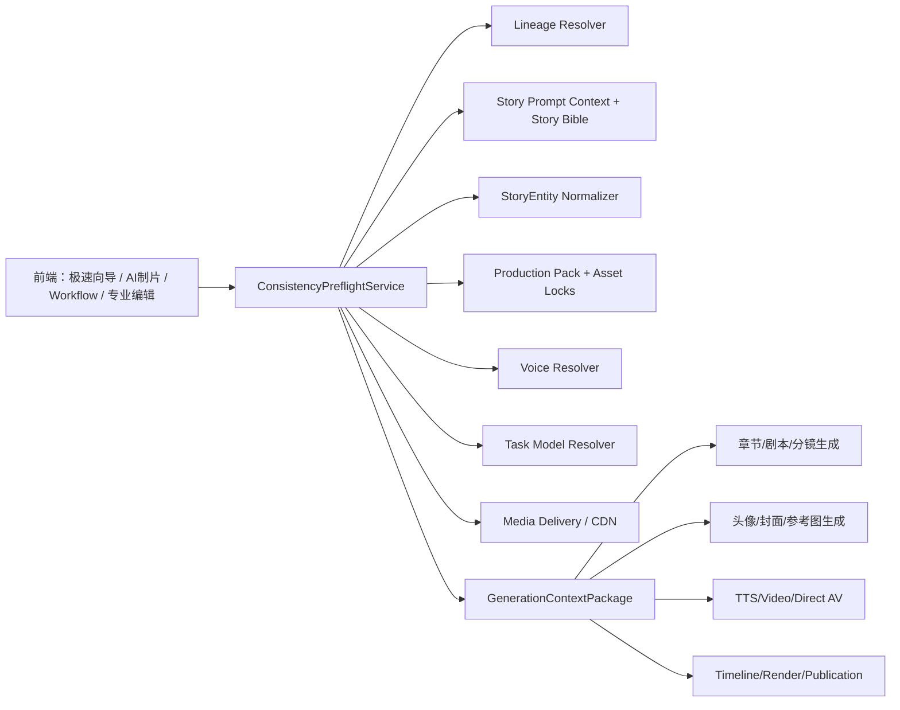

# 生产级动漫创作平台全链路优化实施计划

> **For agentic workers:** REQUIRED SUB-SKILL: Use superpowers:subagent-driven-development or superpowers:executing-plans to implement this plan task-by-task. Steps use checkbox (`- [ ]`) syntax for tracking.

**Goal:** 在不破坏现有底层架构的前提下，把平台从“功能丰富的生成工具集合”收敛为“个人/小团队可用的小说到动漫短视频生产线”，重点解决全局一致性、AI 全流程辅助、低门槛工作流、生产可验收和前端可见性。

**Architecture:** 复用现有 `Novel -> Chapter -> Script -> Storyboard -> Shot -> Media/Video/TTS/Subtitles/Timeline/Render` 链路，新增轻量生产一致性中枢 `GenerationOrchestrator / ConsistencyPreflightService`。所有生成入口先经过同一套 lineage 解析、Story Bible/StoryEntity/Asset/Voice/Model/Media Delivery 预检，再生成 prompt、seed、引用资产和任务元数据。

**Tech Stack:** FastAPI + async SQLAlchemy + SQLite/PostgreSQL, Next.js 14 + React + TypeScript + Tailwind, Playwright, pytest, FFmpeg/外部生产适配。

---

## 0. 本轮判断

### 0.1 假设

- 当前需求跨度非常大，本计划先做生产级诊断和可执行改造路线，不在本轮做破坏性重写。
- 现有大量 P0/P1 能力已经落地，后续要优先“贯穿、收敛、门禁化、前端显性化”，而不是重复造模块。
- DEV_MODE 仍保留，但生产验收必须能区分 DEV_MODE 本地草稿、外部适配任务、真实云端产物和最终可发布文件。
- 个人/小团队使用优先级高于大型企业流程；多人审核、模板市场、复杂权限可放 P2。

### 0.2 成功标准

- 用户能从小说导入/编辑开始，通过 AI 制片向导完成章节、剧本、分镜、镜头、资产参考、配音、字幕、视频、合成和发布草稿。
- 任一生成任务都能追踪 `novel_id/chapter_id/script_id/storyboard_id/shot_id`，并保留 Story Bible、实体、资产版本、音色、模型、seed、prompt version。
- 生产模式下，缺角色/场景/道具锁、缺字幕、模型未验证、参考图不可公网访问、lineage 不匹配等问题在任务提交前被阻断或明确降级。
- 前端默认给非专业用户“一键继续、AI 补齐、问题修复、预检通过后生成”，专家 JSON 字段默认隐藏。
- 自动化测试覆盖 DEV_MODE 全链路、非 DEV 预检门禁、最终成片 artifact、权限和模型配置。

---

## 1. 当前架构深度分析

### 1.1 已具备的优势

| 领域 | 已有能力 | 代表文件 |
| --- | --- | --- |
| 基础生产链路 | Novel、Chapter、Script、Storyboard、Shot、VideoJob、TTSJob、MediaGenerationJob、SubtitleTrack、Timeline、Workflow | `backend/app/models/*` |
| 故事上下文 | 合并小说、章节、Story Bible、StoryEntity、Character，输出写作/视频连续性约束 | `backend/app/services/story_prompt_context.py` |
| 一致性提示词 | 注入项目风格、Story Bible、角色、镜头、锁定资产文本 | `backend/app/services/prompt_composer.py` |
| 视频一致性 | 视频端点可推导完整 lineage、过滤错小说角色、派生 series/chapter/storyboard/shot seed、引用资产/多视图/字幕 | `backend/app/api/v1/endpoints/video.py` |
| 实体和资产 | StoryEntity 支持 character/scene/prop/event；Asset 支持 scope、entity、version、lock/final、prompt/job 元数据 | `backend/app/models/story_entity.py`, `backend/app/models/asset.py` |
| 生产控制 | 生产资料包、资产版本锁、媒体巡检、质量检查、制片助手 | `backend/app/services/production_control.py` |
| 前端入口 | 极速向导、AI 制片、workflow、小说详情、剧本、分镜、镜头、资产、实体、视频、TTS、合成、模型配置 | `frontend/src/app/*` |
| 测试基础 | pytest 和 Playwright 已覆盖 DEV_MODE 全链路、实体、资产多视图、视频 lineage、字幕、workflow render | `backend/test_*.py`, `frontend/e2e/*.spec.ts` |

### 1.2 当前核心问题

| 问题 | 影响 | 优先级 |
| --- | --- | --- |
| 一致性是“可选增强”，不是所有生成任务的强制预检门 | 用户仍可能生成随机角色、错章节、无字幕、无资产锁的视频 | P0 |
| `shot.extra_data.entity_refs` 结构混用 ID 和 dict | 资产锁、prompt 重建、批量媒体生成容易读错 | P0 |
| 资产锁服务存在具体 bug 与语义风险 | 锁定资产 prompt 可能异常；解锁一个镜头可能解除共享资产锁 | P0 |
| 视频端点最强，其它端点落后 | 直生音视频、TTS、参考图、剧本/分镜生成没有统一生产包 | P0 |
| 前端能力分散 | 用户需要在多个页面理解专业流程，不符合低门槛目标 | P0 |
| 镜头/资产编辑仍暴露 JSON | 非专业用户难理解资产版本锁、关键帧、多视图、provider options | P0/P1 |
| 生产与 DEV 状态隔离不够 | 容易把本地占位草稿误认为真实云端生成/真实转码 | P0 |
| 测试多数是 DEV_MODE 或 manifest 级 | 缺真实生产门禁、最终 MP4 可播放/音轨/字幕/顺序验收 | P0 |

### 1.3 具体代码风险

- `backend/app/services/consistency_context.py` 中 `auto_fill_shot_entity_refs()` 定义两次，后者覆盖前者。
- `backend/app/services/asset_lock_service.py` 中 `await db.execute(...).scalar_one_or_none()` await 优先级错误。
- `backend/app/services/asset_lock_service.py` 的 `unlock_shot_assets()` 会修改共享 Asset 的 `is_locked`，不只是解除 Shot 引用。
- `AssetLockService._get_entity_locked_asset()` 接收 `entity_type` 但查询未使用。
- `build_consistency_prompt()` 未把 `locked_assets` 传给 `compose_generation_prompt()`，部分重建 prompt 路径可能丢资产锁。
- `frontend/src/app/workflow/page.tsx` 无 `workflow_id` 时自动创建新 workflow，容易产生隐式项目垃圾。
- `frontend/src/app/tts/page.tsx` 按小说筛剧本但不按章节筛剧本，可能选错章节上下文。
- `frontend/src/app/scripts/page.tsx` 自定义 AI 剧本生成疑似调用 `/coding-plan/storyboard`，语义不匹配。
- `frontend/src/app/synthesis/page.tsx` 仍使用 raw fetch 和简单 video+TTS 配对，落后于 workflow render/timeline/subtitle 管线。

---

## 2. 目标架构：全局一致性中枢

### 2.1 设计原则

不新增一套“大而全”平台内核，而是在现有服务之上增加一个统一门面：



### 2.2 新增核心对象

建议新增服务文件：

- `backend/app/services/generation_orchestrator.py`
- `backend/app/services/consistency_preflight.py`
- `backend/app/services/entity_ref_normalizer.py`

建议统一输出：

```python
class GenerationContextPackage(TypedDict):
    task_type: str
    lineage: dict
    story_bible_id: str | None
    story_context: dict
    entity_refs: dict
    character_refs: list[dict]
    scene_refs: list[dict]
    prop_refs: list[dict]
    event_refs: list[dict]
    asset_version_locks: list[dict]
    reference_images: list[dict]
    voice_locks: list[dict]
    subtitle_text: str | None
    model_route: dict
    seed_pack: dict
    prompt_blocks: dict
    issues: list[dict]
    blocking_issue_count: int
    autofix_actions: list[dict]
```

### 2.3 预检规则

| 规则 | 生产模式 | DEV_MODE |
| --- | --- | --- |
| lineage 不匹配 | 阻断 | 阻断 |
| 未绑定小说/章节/镜头 | 阻断高风险任务 | 提示并允许草稿 |
| Story Bible 缺失 | 可自动生成；失败则阻断视频/批量生产 | 自动生成或提示 |
| 角色/场景/道具缺实体 | 自动抽取；仍缺则 warning/按任务阻断 | 自动抽取 |
| 角色三视图/场景/道具定稿缺失 | 视频/直生音视频生产阻断或必须显式降级 | warning |
| 参考图不是公网 URL | 云端图生视频阻断或切换文生视频 | warning，跳过图片 |
| 模型未验证/API Key 不可用 | 生产阻断 | 使用 DEV_MODE 并明确标记 |
| 字幕/对白缺失 | 有对白镜头阻断；无对白镜头 warning | warning |
| 角色音色缺失 | TTS 阻断或自动选择默认音色并记录 | warning |
| 最终渲染缺片段/音频/字幕 | render preflight 阻断或明确降级 | warning/本地 artifact |

---

## 3. 全模块 AI 赋能改造方案

### 3.1 小说与章节

现状：小说创建、导入、章节 AI 续写/润色、封面生成已经存在。

改造：

- 小说创建时自动生成 `Series Plan` 草案：目标集数、每集覆盖章节、短剧钩子、反转、悬念。
- 章节 AI 续写输出必须包含 `title_suggestion`、`continuity_summary`、`entity_delta`。
- 章节保存后标记 Story Bible/实体状态机 stale，并给出“一键同步设定”。
- 封面生成只在弹窗中选择风格，不在详情页默认展开风格库。

P0 文件：

- `backend/app/api/v1/endpoints/chapters.py`
- `backend/app/services/chapter_naming.py`
- `backend/app/services/novel_continuity.py`
- `frontend/src/app/novels/[id]/page.tsx`

### 3.2 剧本

现状：剧本生成已接入上下文，但编辑辅助仍可脱离完整 production pack。

改造：

- `generate_script` 和 `ai_assist_script_edit` 均走 `GenerationOrchestrator(task_type="script_generation")`。
- 生成前展示本章承接：上一章状态、当前章事件、下一章不可矛盾约束。
- AI 辅助按钮：润色简介、改台词、短剧化、提炼旁白、修复 OOC。
- 生成后自动跑剧本一致性检查，并把问题显示在编辑页顶部。

### 3.3 角色、实体、资产

现状：角色/实体/资产/多视图都有基础能力。

改造：

- 角色、场景、道具统一走 StoryEntity 作为权威实体，Character/Asset 是其业务/视觉扩展。
- 资产库默认显示全局资产 + 当前小说资产；统计也按同样规则计算。
- 三视图/四视图/多视图生成必须绑定具体小说实体，禁止只按资产名自由生成。
- 人物视图生成强制先生成/锁定正面定稿，再用正面作为参考生成侧面/背面；后续视图失败时显示“需要公网参考图/模型不支持参考图/已降级纯 prompt”。
- 资产编辑从 JSON 改为表单：视图类型、比例、参考图、用途、绑定实体、锁定状态、重生成按钮。

P0 文件：

- `backend/app/services/image_prompt_policy.py`
- `backend/app/services/asset_generation_service.py`
- `backend/app/api/v1/endpoints/assets.py`
- `frontend/src/app/assets/page.tsx`
- `frontend/src/app/entities/page.tsx`

### 3.4 分镜与镜头

现状：智能分镜、镜头字段、质量检查、多视图上下文已存在。

改造：

- 分镜生成前强制通过：章节/剧本上下文、Story Bible、实体 refs、风格模板、镜头数量/时长目标。
- 镜头管理分为“创作模式”和“专家模式”：
  - 创作模式：画面、角色、场景、道具、台词、情绪、镜头运动、参考风格、AI 优化。
  - 专家模式：asset version locks、keyframes、multiview refs、provider options。
- 镜头台词 AI 提炼必须读取小说章节、剧本、角色性格、场景事件，并输出说话人、台词、旁白、字幕。
- 每个镜头显示“能否生产”：角色锁、场景锁、道具锁、字幕、音色、参考图、模型。

P0 文件：

- `backend/app/api/v1/endpoints/storyboards.py`
- `backend/app/api/v1/endpoints/shots.py`
- `frontend/src/app/storyboards/page.tsx`
- `frontend/src/app/shots/page.tsx`

### 3.5 图像、TTS、视频、直生音视频

现状：视频端点较强，图像/TTS/直生音视频还有 prompt-only 或可选一致性路径。

改造：

- 图片生成：头像、封面、角色视图、场景图、道具图、镜头参考图全部调用统一 `GenerationContextPackage`。
- TTS：按 Story Bible/Character/VoiceClone 解析音色；按章节和剧本过滤对白来源；生成后创建/更新字幕轨。
- 视频：保留现有 `_build_video_consistency_package()`，但其输出应来自统一 orchestrator。
- 直生音视频：生产模式下必须检查模型 capability、字幕、音频策略、参考图公网可达、资产锁。

### 3.6 合成、时间线、发布

现状：workflow render package 已具备 artifact，真实渲染和 `/synthesis` 页面落后。

改造：

- `/synthesis` 收敛到 workflow/timeline/render 管线，保留简单合成作为“快速配对工具”。
- render preflight 增加最终文件级验收：段落顺序、音轨、字幕轨、总时长、文件存在、可播放。
- Publication 显示版本、源 workflow、字幕版本、导出比例、下载链接和重新渲染。

---

## 4. 前端交互整体优化方案

### 4.1 导航策略

默认给用户三层入口：

- **开始创作**：极速向导，导入/输入小说，一键生成首集草片。
- **AI 制片**：继续制作、检查问题、补齐资产、生成下一集、合成导出。
- **专业工具**：小说、实体、资产、剧本、分镜、镜头、视频、TTS、字幕、时间线、模型配置。

### 4.2 全局生产状态条

新增组件：

- `frontend/src/components/production/production-status-rail.tsx`
- `frontend/src/components/production/production-lock-summary.tsx`
- `frontend/src/components/production/preflight-issue-list.tsx`

显示：

- 当前小说/章节/工作流。
- 故事设定、角色、场景、道具、字幕、音色、参考图、模型、渲染包状态。
- “下一步”按钮：执行 producer assistant 返回的 `next_action`。

### 4.3 页面级调整

| 页面 | P0 调整 |
| --- | --- |
| `/quick-start` | 自动保存保留；生成前展示预检；生成后直接进入 AI 制片而不是让用户找入口 |
| `/producer` | 把 next_action 做成可执行按钮；作为默认继续制作页 |
| `/workflow` | 无 `workflow_id` 时先让用户选择/创建，不静默创建；生产控制台置顶 |
| `/shots` | 默认创作模式；隐藏 JSON；增加“AI 修复镜头”“补齐参考图”“生成台词” |
| `/video-generation` | 生成前 checklist + 一键补齐；模型选择只显示已验证配置，默认选任务默认模型 |
| `/tts` | 剧本/镜头按小说+章节过滤；音色试听、克隆、角色绑定状态统一展示 |
| `/synthesis` | 接入 workflow render/timeline/subtitle；历史预览使用弹窗/侧栏，不要求滚动到顶部 |
| `/assets` | 资源 URL/缩略图支持上传/选择/预览；编辑抽屉或弹窗固定在视口内 |
| `/llm-config` | 按文本/图片/声音/视频/直生音视频/合成展示默认和验证状态 |

---

## 5. P0 实施任务

### Task P0-1: 统一生产预检服务

**Files:**

- Create: `backend/app/services/consistency_preflight.py`
- Create: `backend/app/services/entity_ref_normalizer.py`
- Modify: `backend/app/services/consistency_context.py`
- Modify: `backend/app/api/v1/endpoints/consistency.py`

- [ ] 写测试：lineage 不匹配、缺资产锁、参考图不可公网访问、模型未验证时返回 blocking issue。
- [ ] 合并重复 `auto_fill_shot_entity_refs()`，统一输出 dict refs + id 索引。
- [ ] 新增 `normalize_entity_refs()`，兼容旧 ID 列表和新 dict refs。
- [ ] 新增 `build_generation_context_package()`，调用 Story Prompt Context、Story Bible、Production Pack、Model Registry、Media Delivery。
- [ ] 增加 `POST /api/v1/consistency/preflight` 供前端预览。

### Task P0-2: 修复资产锁并接入 prompt

**Files:**

- Modify: `backend/app/services/asset_lock_service.py`
- Modify: `backend/app/services/prompt_composer.py`
- Modify: `backend/app/api/v1/endpoints/shots.py`
- Modify: `backend/app/api/v1/endpoints/video.py`
- Test: `backend/test_asset_lock_service.py`, `backend/test_prompt_composer_locked_assets.py`

- [ ] 修复 await 优先级。
- [ ] `unlock_shot_assets()` 只解除 Shot 绑定，不修改共享 Asset 定稿锁。
- [ ] 查询时按 `entity_type/category`、`entity_id`、`novel_id/global` 过滤。
- [ ] `build_consistency_prompt()` 传入 locked assets。
- [ ] 新增测试：锁定资产出现在最终 prompt 和 job metadata。

### Task P0-3: 生产模式强制门禁

**Files:**

- Modify: `backend/app/api/v1/endpoints/video.py`
- Modify: `backend/app/api/v1/endpoints/media.py`
- Modify: `backend/app/api/v1/endpoints/tts.py`
- Modify: `backend/app/api/v1/endpoints/images.py`
- Modify: `backend/app/api/v1/endpoints/workflow.py`

- [ ] `use_consistency_context=False` 仅 DEV/admin 或显式 unsafe mode 可用。
- [ ] 生产视频/直生音视频提交前必须跑 preflight。
- [ ] 缺公网参考图时阻断图生视频或明确降级文生视频。
- [ ] 模型未验证/API Key 不可用时不创建“假成功”任务。
- [ ] TTS 按 Story Bible/Character/VoiceClone 解析音色；章节上下文不匹配阻断。

### Task P0-4: 前端全局生产状态与下一步

**Files:**

- Create: `frontend/src/components/production/production-status-rail.tsx`
- Create: `frontend/src/components/production/preflight-issue-list.tsx`
- Modify: `frontend/src/components/layout/main-layout.tsx`
- Modify: `frontend/src/app/producer/page.tsx`
- Modify: `frontend/src/app/workflow/page.tsx`
- Modify: `frontend/src/lib/api-client.ts`

- [ ] 新增 API client：`preflightGeneration`、`getWorkflowProductionStatus`。
- [ ] 将 producer/workflow 的 next_action 做成执行按钮。
- [ ] 不再无参数静默创建 workflow。
- [ ] 所有生产页展示同一套锁定状态和阻断问题。

### Task P0-5: 镜头和资产低门槛编辑

**Files:**

- Modify: `frontend/src/app/shots/page.tsx`
- Modify: `frontend/src/app/assets/page.tsx`
- Modify: `frontend/src/components/media/reference-image-preview.tsx`

- [ ] 镜头默认创作模式；专家 JSON 折叠在“高级参数”。
- [ ] 资产 URL/缩略图支持上传、从生成历史选择、即时预览、大图弹窗。
- [ ] 角色/场景/道具视图生成按钮按实体类型显示不同引导。
- [ ] 增加“重新生成并沿用当前锁定设定”。
- [ ] 参考风格样例只在用户点击生成封面/头像/参考图时弹出。

### Task P0-6: Synthesis 与 Workflow 渲染统一

**Files:**

- Modify: `frontend/src/app/synthesis/page.tsx`
- Modify: `backend/app/api/v1/endpoints/synthesis.py`
- Modify: `backend/app/api/v1/endpoints/workflow.py`
- Test: `backend/test_workflow_routes.py`, `frontend/e2e/full-flow.spec.ts`

- [ ] `/synthesis` 支持按小说/章节/剧本/分镜/镜头筛选历史。
- [ ] 历史播放用弹窗/侧栏，不复用顶部生成窗口。
- [ ] 接入 workflow manifest、timeline、subtitle tracks、direct AV jobs。
- [ ] render 后验证 artifact 200、SRT 包含当前镜头对白。

### Task P0-7: 紧凑全链路验收套件

**Run:**

```bash
cd backend
DEV_MODE=true PYTHONPATH=. pytest -q \
  tests/test_p0_consistency_pipeline.py \
  test_story_prompt_context.py \
  test_asset_multiview_generation.py \
  test_media_subtitles.py \
  test_tts_story_bible.py \
  test_workflow_routes.py
```

```bash
cd frontend
PATH=/opt/homebrew/opt/node@22/bin:$PATH npx tsc --noEmit
PATH=/opt/homebrew/opt/node@22/bin:$PATH npm run build
PATH=/opt/homebrew/opt/node@22/bin:$PATH npx playwright test \
  e2e/full-flow.spec.ts \
  e2e/assets.spec.ts \
  e2e/entities-multiview.spec.ts \
  e2e/storyboard-shot-multiview.spec.ts \
  e2e/shots-multiview.spec.ts \
  e2e/video-preflight-multiview.spec.ts \
  --project=chromium
```

Add tests:

- Non-DEV preflight blocks unverified model and non-public local reference image.
- Final render artifact contains ordered segments, audio/subtitle metadata, and playable file path.
- Protected pages reject unsigned DEV token when DEV_MODE=false.

---

## 6. P1 实施任务

- [ ] AI 制片助手自动执行安全 next_action：补实体、补 Story Bible、补资产、补字幕、生成媒体、渲染。
- [ ] Series Plan 升级为多集生产看板：每集覆盖章节、剧本/分镜/媒体/成片状态、下一集承接。
- [ ] Timeline 可视化增强：拖拽片段、字幕时间码、BGM/SFX、镜头重排后自动更新时间线。
- [ ] 质量评分升级：图片多模态相似度、角色视图一致性、字幕时长、音画同步。
- [ ] 模型方案预设：极速省钱、质量优先、国产模型、直生音视频优先、本地/ComfyUI 优先。
- [ ] 批量生成队列：失败重试、跳过、暂停、成本估算、任务限流。

---

## 7. P2 实施任务

- [ ] 多人审核：角色审、分镜审、字幕审、成片审，支持评论和版本回滚。
- [ ] LoRA/IP-Adapter/ControlNet/ComfyUI 深度适配：模板参数、参考图节点映射、输出回写。
- [ ] 口型同步：Live2D/Rhubarb/供应商 lip sync，按角色音频生成 viseme/mouth cues。
- [ ] 模板市场/素材市场：系统模板、项目模板、用户收藏、复用次数和评分。
- [ ] 发布生态：9:16/16:9/1:1、多语言字幕、封面、标题简介标签、平台发布包。
- [ ] 成本与配额：按小说/集/镜头估算成本，设置预算上限和模型降级策略。

---

## 8. 测试与验收标准

### 8.1 功能验收

- 小说导入/编辑后能生成章节标题、章节正文、实体增量、Story Bible 同步建议。
- 剧本生成不引用后续章节作为前情，不产生未登记人物。
- 分镜和镜头生成后 `entity_refs`、字幕、角色 refs、场景/道具/事件 refs 不为空或有明确原因。
- 角色三视图绑定同一 StoryEntity 和视觉契约，侧面/背面 prompt 明确禁止正面和拼贴。
- 视频生成任务 metadata 包含 series/chapter/storyboard/shot seed、style lock、asset locks、subtitle、reference image delivery。
- TTS 任务记录 `voice_source`，同一角色跨镜头音色一致。
- 合成输出能播放、下载、重复预览，历史媒体 URL 经过持久化或公网交付配置。

### 8.2 生产验收

- `DEV_MODE=false` 时，未验证模型不能被当成成功配置使用。
- 本地 `/static/...` 参考图没有对象存储/CDN配置时，不传给云端图生视频。
- render preflight 阻断缺 segment/缺 video_url/缺 timeline 的导出。
- 所有外部适配任务状态明确为 `adapter_ready/pending/succeeded/failed`，不混淆为真实完成。

### 8.3 稳定性验收

- API Key 使用稳定 `FERNET_KEY`，重启后可解密。
- `next build` 后重启 dev server 再跑 Playwright，避免 stale chunk。
- 前后端启动、健康检查、核心 E2E 命令写入开发文档。
- 媒体巡检能发现本地文件缺失、远程临时链接过期、CDN 未配置。

---

## 9. 部署与生产适配

### 9.1 必需配置

- `FERNET_KEY`: 生产固定，保护已保存 API Key。
- `DATABASE_URL`: PostgreSQL 推荐。
- `MEDIA_STORAGE_MODE`: `local | object_storage | cdn_proxy`。
- `PUBLIC_MEDIA_BASE_URL`: 云端视频模型可访问的静态媒体域名。
- `FFMPEG_BIN` 或云渲染 provider 配置。
- 模型配置按用户隔离，任务默认模型按用户/项目可覆盖。

### 9.2 媒体持久化

- 远程图片/视频/TTS 结果必须转存本地或对象存储。
- Job 保留 `original_url`、`persistent_url`、`public_provider_url`、`expires_at`。
- 视频历史播放使用 `persistent_url`，云端生成使用 `public_provider_url`。

### 9.3 观测与回滚

- 每个生成任务写入：provider、model、prompt_hash、context_version、asset_lock_version、cost、duration。
- 每个 production pack 写入 version；重新生成时产生 variant，不覆盖旧版本。
- 发布包保留 render manifest、timeline、subtitle export、源 job IDs。

---

## 10. 建议执行顺序

1. P0-1/P0-2：先修一致性预检和资产锁，因为这是后续所有生成的底座。
2. P0-3：把视频、直生音视频、TTS、图片纳入强制门禁。
3. P0-4/P0-5：让前端用户看见并能一键修复阻断问题。
4. P0-6：统一合成历史、预览、下载和 workflow render。
5. P0-7：跑紧凑验收套件，补非 DEV 预检测试。
6. P1：Series Plan、AI 制片自动下一步、Timeline、质量评分和批量队列。
7. P2：插件生态、多审、口型、模板市场、成本配额。

---

## 11. 最终交付物对应关系

| 用户要求 | 本计划覆盖位置 |
| --- | --- |
| 现有代码深度分析报告 | 第 1 章 |
| 全模块 AI 赋能开发方案 | 第 3 章 |
| 全局实体一致性中枢 | 第 2 章 |
| 智能引导工作流 | 第 4、5、6 章 |
| 前端界面交互优化 | 第 4、5 章 |
| 测试用例与验收标准 | 第 8 章 |
| 分阶段排期优先级 | 第 5、6、7、10 章 |
| 生产稳定运行和部署 | 第 9 章 |

